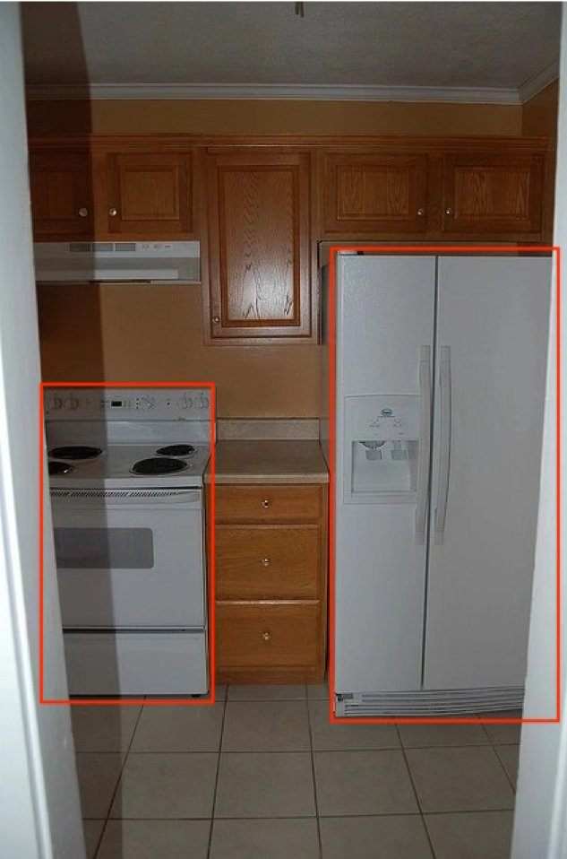
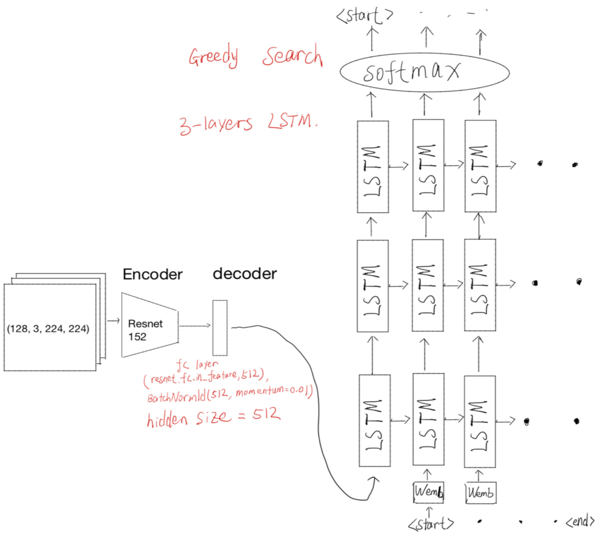
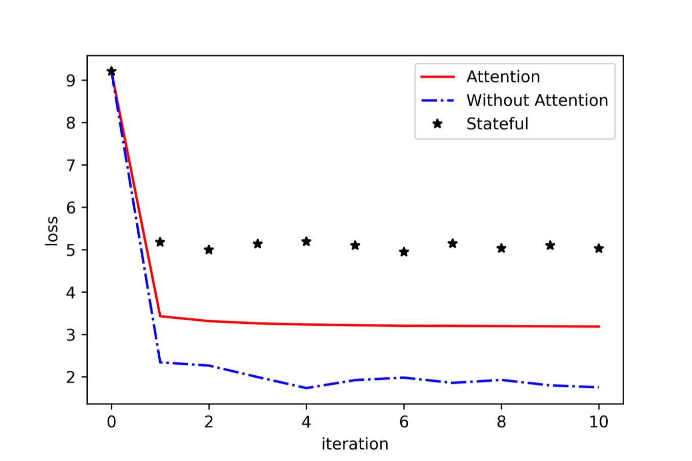
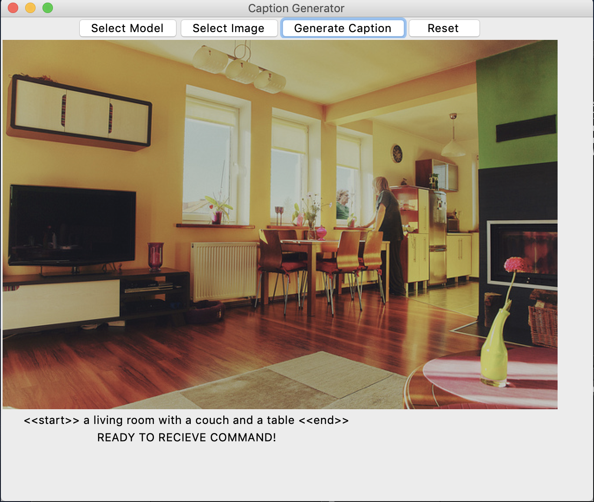
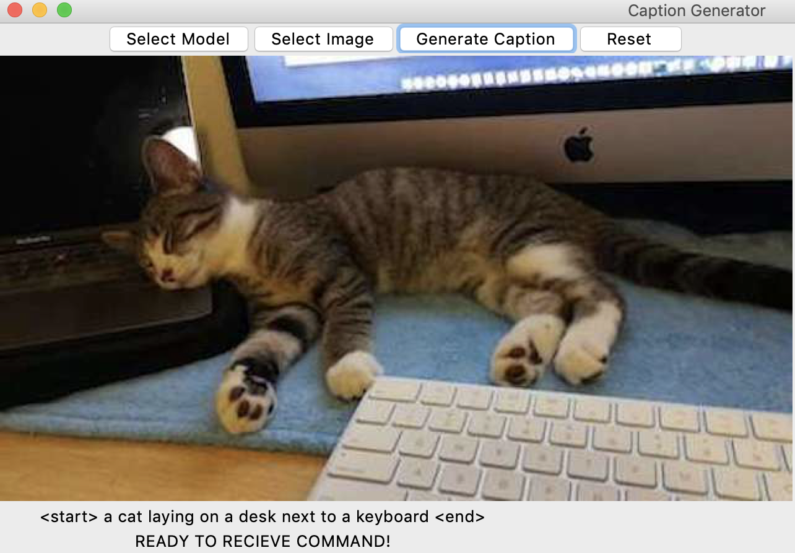

# Show and Tell: A Neural Image Caption Generator

Please see our [final report](./Final_report.pdf) for details about this project.

## Dataset
We used MSCOCO 2014 for our training and testing. There are 83K training images and 41K testing images. Each image come with 5 human captions. Human captions are used to training, as a target, and testing, calculating **Bleu-4** score Images come in different size. We train our model on those 83K training images and tested on 41K testing images. Following are examples of training and testing images.

### Example images

Human Captions:
- A kitchen with a refrigerator, stove and oven with cabinets.
- A white oven and a white refrigerator are in the kitchen.
- The refrigerator is brand new and was delivered today.
- Stark white appliances stand out against brown wooden cabinets.
- Kitchen appliances and cabinets as seen through opening.

## Model Structure

### Word embedding
We did not used any pre-trained word embedding. We generated world embedding from the 5 human captions comes with each images. Then we added *<start*>, *<end*>, *<unk*>, *<pad*> token into our vocabulary. The order of the vocabulary is essential, and the model has to be trained and tested using the exactly same vocabulary.

### Encoder
Our model uses **Resnet152** as encoder with batch size of 128. The input data is a 4-D Tensor (128, 3, 224, 224). We resized all image to 250 X 250, and apply random cropping. The final image size is 224 X 224. 
### Decoder
We used a multiple layers of **LSTM** as decoder. Then we apply **Greedy Search** to find the optimal generated sentence. (The paper used **Beam Search** and claimed better performence). 

## Result
Following is the loss comparison. The model performance is measured using *Bleu-4* score. Since the *Bleu-4* score is very difference using difference smoothing function, so we computed a baseline *Bleu-4* score by taking the average of one human caption against other 4 captions for each caption on all testing images. Our baseline *Bleu-4* is 0.3008. The average *Bleu-4* score of our model performed better than this baseline.

## Simple UI
We also built a simple user interface for this model. You can selected pre-trained model and insert the image you want. The model will generate a sentences accordingly. This simple UI is tuned using CPU, so you can run it on your Mac without a CUDA GPU. Here are some example output of our model using this simple UI. 

- Here is an example image in the MSCOCO dataset

- Here is an example input outside of MSCOCO dataset. Of course, this is my cat! If you star this repo. I might upload more cat picture for you.

We can see the result is actually pretty good. However, when there are multiple objects in the picture, the model can only caption some of the objects and miss the others. This really depends on the human captions the model is trained on.

## Reference
[1] Vinyals, O., Toshev, A., Bengio, S., & Erhan, D. (2015). Show and tell: A neural image caption generator. In Proceedings of the IEEE conference on computer vision and pattern recognition (pp. 3156-3164).

## Acknowledgments
- [Vinyals, Oriol, et al. “Show and Tell: A Neural Image Caption Generator.” 2015 IEEE Conference on Computer Vision and Pattern Recognition (CVPR), 20 Apr. 2015, doi:10.1109/cvpr.2015.7298935.](./Show&Tell.pdf)

- [Yunjey. “Yunjey/Pytorch-Tutorial.” GitHub, 6 June 2018, github.com/yunjey/pytorch-tutorial/tree/master/tutorials/03-advanced/image_captioning.](https://github.com/yunjey/pytorch-tutorial/tree/master/tutorials/03-advanced/image_captioning)

- My lovely teammates:
  - Qi Tang
  - Shuhui Guo
  - Xiang Cui
  - Yutong Dai
